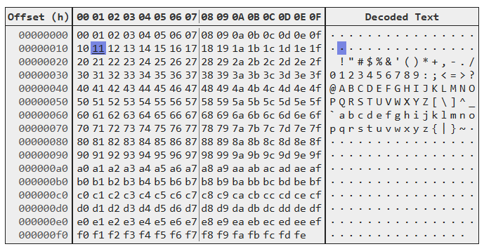

# Hexedit-JS
> A very basic embeddable Hex Editor / Viewer in vanilla Javascript



**This is currently just an early prototype and very much work in progress**

## Features
- Byteoffsets, hex and text panels
- Select and edit bytes in the hex or text panel
- Change selection using arrow keys
- Copy and paste from and to the hex or text panels (past will always overwrite)
- Readonly mode for simply presenting binary content
- Easily embeddable using vanilla javscript & css in any webpage

## Usage
1. Obtain the `hexedit.js` and `hexedit.css` files and add them to the page
2. Add a div with a unique ID to the page: `<div id="myHexeditor"></div>` (the editor will be rendered using this div)
3. Initialize the hexeditor using javascript (make sure it's loaded after the DOM is created)
```javascript
// Create some binary example data 
const data = new Uint8Array(512)
for (let i = 0; i < data.length; i++) data[i] = i % 256

// Create the hexeditor in for the element
const myHexedit = new HexEditor(document.getElementById("myHexeditor"))
// Attach the data to editor
myHexedit.data = data
// Render the DOM. This needs to be called after changing the attached data outside of the editor
myHexedit.renderDom()

// Optionally set readonly mode
// myHexedit.readonly = true
```
4. The hexeditor can now be used to view and edit the binary data
5. When changing bytes through the editor, the attached binary `data` will be changed as well

View the [index.html](src/index.html) for a full example.